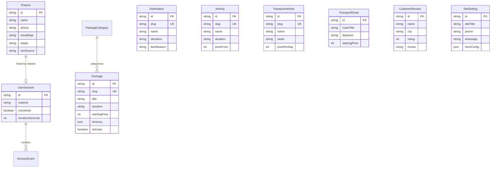

# The Indian Wings Company — Master Project Documentation
**Official Technical, Architectural & Implementation Reference Manual**

*Version 2.0 | Production Release — September 2026*

---

## Table of Contents

1. [Executive Summary & Project Vision](#1-executive-summary--project-vision)
2. [Target Production Architecture](#2-target-production-architecture)
3. [Design System & Brand Identity](#3-design-system--brand-identity)
4. [Data Architecture & Schema Specifications](#4-data-architecture--schema-specifications)
5. [Lead Engine & Zero-Loss Resilience Pipeline](#5-lead-engine--zero-loss-resilience-pipeline)
6. [MakeMyTrip (MMT) UI Placement & Conversion Blueprint](#6-makemytrip-mmt-ui-placement--conversion-blueprint)
7. [Admin Portal, Content Management & Live Telemetry](#7-admin-portal-content-management--live-telemetry)
8. [Google SEO Engine, Structured Data & Sitemaps](#8-google-seo-engine-structured-data--sitemaps)
9. [Media & Cloud Delivery Specifications](#9-media--cloud-delivery-specifications)
10. [Third-Party Services Directory](#10-third-party-services-directory)
11. [Complete Implementation Roadmap (Phases 1–15)](#11-complete-implementation-roadmap-phases-115)
12. [Production Deployment & Infrastructure Runbook](#12-production-deployment--infrastructure-runbook)

---

## 1. Executive Summary & Project Vision

### 1.1 Project Purpose
**The Indian Wings Company** is a premier luxury travel agency and destination management company specializing in the Kashmir Valley. The web platform delivers a cinematic, mobile-first booking experience tailored for high-intent domestic and international travelers seeking curated Kashmir holiday packages, luxury Dal Lake houseboats, Gulmarg ski retreats, Pahalgam alpine tours, and private chauffeured transport.

### 1.2 Core Architectural Principles
- **Mobile-First & High Performance**: 75%+ of travel traffic originates from mobile devices; layouts, touch targets, and image payloads are rigorously optimized for cellular speeds.
- **Zero-Loss Lead Engine**: No customer enquiry is ever lost due to network flickers, server outages, or spotty connectivity in mountain terrains. A 3-layer fallback system guarantees lead persistence.
- **Cinematic Visual Excellence**: Deep Midnight Navy `#0B1F2A` paired with Kashmiri Saffron `#F97316` and Warm Sand `#F4EFE6`, enriched by smooth micro-animations and Cloudinary CDN-optimized 4K drone cinematography.
- **Complete Business Independence**: A bespoke admin control suite empowers business owners to update packages, manage hero videos, review inbound leads, inspect UTM marketing campaigns, and edit site metadata without requiring developer intervention.

---

## 2. Target Production Architecture

The system employs a decoupled, production-hardened micro-architecture:

```
                          [ GoDaddy DNS ]
                         theindianwings.com
                                 │
                ┌────────────────┴────────────────┐
                ▼                                 ▼
          [ Vercel ]                        [ Render ]
       Next.js 16 App Router             Express Node.js REST API
   (https://theindianwings.com)        (https://tiwc-api.onrender.com)
                │                                 │
                │                         ┌───────┴───────┐
                ▼                         ▼               ▼
      [ Next.js Edge Cache ]        [ Neon DB ]    [ Upstash Redis ]
     Server-Side Rendering (SSR)   PostgreSQL 16    Distributed Rate
    Static Generation / ISR Cache  Pooled (pgbouncer)   Limiting
```

### 2.1 Technology Stack Matrix
| Component | Technology | Role / Environment |
|---|---|---|
| **Frontend Framework** | Next.js 16 (App Router), React 19, TypeScript | Server-rendered pages, interactive client widgets, SEO head generation |
| **Backend API Engine** | Node.js 22, Express 4.21, TypeScript | Standalone REST API with Helmet security, origin guards, and CRUD routing |
| **Database** | PostgreSQL 16 (Neon Serverless) | Authoritative ACID data store with connection pooling (`pgbouncer`) |
| **Data Access Layer** | Prisma ORM 7.10 | Type-safe queries, migration lifecycle, and JSON column management |
| **Distributed Cache & Rate Limiting** | Upstash Redis (REST API) | Sliding-window DDoS mitigation & burst traffic defense |
| **Media Delivery** | Cloudinary CDN (`next-cloudinary`) | Adaptive bitrate video streaming, WebP/AVIF auto-formatting |
| **Styling & Animation** | Tailwind CSS 3.4, Framer Motion | Fluid responsive grids, bottom sheet springs, and hero fades |
| **Validation & Security** | Zod 3.25, React Hook Form | Strict schema validation, XSS input sanitization, and bot honeypot traps |
| **Email Service** | Nodemailer with SMTP | Automated itinerary delivery and internal sales lead dispatch |

---

## 3. Design System & Brand Identity

### 3.1 Color Palette
- **Midnight Navy (`#0B1F2A`)**: Primary luxury background and high-contrast typography base. Imparts elegance, night-sky alpine depth, and premium distinction.
- **Kashmiri Saffron (`#F97316` / `#EA580C`)**: High-converting accent tone used for Primary CTAs, price tags, interactive hover states, and discount badges.
- **Warm Sand (`#F4EFE6`)**: Soft neutral foundation for background contrast, card backgrounds, and pill borders.
- **Forest Alpine Emerald (`#064E3B` / `#059669`)**: Trust indicators, WhatsApp actions, verified reviews, and seasonal badge highlights.

### 3.2 Typography Hierarchy
- **Headlines**: *Playfair Display* (Serif) — Evokes heritage, bespoke hospitality, and luxury vacation aesthetics.
- **Body & Controls**: *Manrope* (Sans-Serif) — Highly legible, contemporary geometric sans-serif optimized for mobile screens and data density.

### 3.3 UI Components & Micro-Interactions
- **Glassmorphic App Bars**: Floating backdrop-filter navigation with dynamic scroll-depth tinting.
- **MakeMyTrip (MMT) Style Bottom Sheets**: Spring-animated drawer sheets for zero-friction mobile lead submissions.
- **Interactive Badges**: Real-time status indicators ("Instant Confirmation", "Best Seller", "Snow Season Special").

---

## 4. Data Architecture & Schema Specifications

The PostgreSQL database is organized into 11 interconnected relational models:



### 4.1 Schema Models Breakdown
1. **`Enquiry`**: Records all customer booking inquiries with UTM parameters (`utmSource`, `gclid`, `fbclid`), lead status lifecycle (`NEW`, `CONTACTED`, `QUOTED`, `WON`, `LOST`), and IP address.
2. **`UserSession`**: Captures visitor browser journeys, device types, screen resolution, referrers, and conversion flags.
3. **`SessionEvent`**: Micro-event tracking within sessions (scroll depth %, card clicks, modal triggers, dwell time).
4. **`Package` & `PackageCategory`**: Rich travel package listings with comprehensive day-by-day JSON itineraries, inclusions, exclusions, and SEO tags.
5. **`Destination`**: Kashmir valley hubs (Gulmarg, Pahalgam, Sonamarg, Dal Lake, Doodhpathri, Yusmarg) with elevation, distance from Srinagar, and seasonal guides.
6. **`Activity`**: Winter skiing, Dal Lake shikara rides, paragliding, river rafting, and pony trekking.
7. **`TransportVehicle` & `TransportRoute`**: Chauffeur fleet (Innova Crysta, Urbania, Tempo Traveller, 4x4 Thar) and intercity transfer routes.
8. **`CustomerReview`**: Verified traveler ratings, written testimonials, and video review links.
9. **`SiteSetting`**: Global site titles, announcements, phone/WhatsApp numbers, custom robots.txt, and homepage hero configuration.

---

## 5. Lead Engine & Zero-Loss Resilience Pipeline

To eliminate lost revenue from mobile network dropouts, the platform implements a **Three-Layer Zero-Loss Pipeline**:

```
[ User Submits Enquiry ]
         │
         ▼
[ Layer 1: Client-Side Offline Queue (IndexedDB) ]
    Stores payload locally before dispatch.
    If device loses internet, retries automatically on reconnect.
         │
         ▼
[ Layer 2: Secure Express / Next.js REST API ]
    - Bot Trap: Hidden honeypot field inspection.
    - Upstash Rate Limit: 5 requests / 10 minutes.
    - Idempotency: Duplicate check within 5 minutes.
    - Atomic DB Write: Persisted into PostgreSQL.
    - Email Service: Sends itinerary & alerts sales desk.
         │ (If Server Errors / 500 Failure)
         ▼
[ Layer 3: Instant WhatsApp Fallback (`wa.me`) ]
    Redirects customer to pre-filled WhatsApp chat with Srinagar
    desk specialists. Zero lead attrition under any conditions.
```

---

## 6. MakeMyTrip (MMT) UI Placement & Conversion Blueprint

Drawing inspiration from India's highest-converting travel applications, conversion mechanisms are embedded at critical points:

1. **Sticky Bottom Mobile Bar**: Persistent bottom action drawer on mobile viewports featuring "Get Instant Quote" and direct WhatsApp access.
2. **Inline Contextual Triggers**: Dynamic package cards pass the package title, duration, and price directly into the enquiry modal.
3. **Instant Itinerary Gate**: Customers can download comprehensive PDF-formatted itineraries by entering their phone/email, capturing high-intent leads earlier in the research phase.

---

## 7. Admin Portal, Content Management & Live Telemetry

An isolated administration console is accessible at `/admin`:

```
Admin Portal Dashboard
 ├── Overview & Metrics (Total Leads, Leads Today, Conversion %, Average Dwell Time)
 ├── Inbound Leads Inbox (Status workflow: NEW → CONTACTED → WON)
 ├── Marketing Campaigns (UTM clicks, conversion rates per Google/Meta campaign)
 ├── Homepage Hero Editor (Change headline, badge, video URL, slides & trust pills)
 ├── Tour Packages Manager (Full CRUD with visual day-by-day itinerary builder)
 ├── Destinations & Activities (Add seasonal spots, change pricing & photos)
 ├── Transport Fleet & Routes (Manage vehicle fleet and route rates)
 ├── Customer Reviews (Manage written testimonials and video reviews)
 └── SEO & Settings (Edit site title, meta description, contact info & robots.txt)
```

### 7.1 Security Architecture
- **Cryptographic Session Cookies**: HMAC-SHA256 authenticated `tiwc_admin_session` cookie.
- **Cross-Origin Compatibility**: Set with `SameSite=None; Secure` so the Vercel-hosted admin interface securely queries the Render backend API.
- **Timing-Safe Password Verification**: Protects against side-channel timing attacks.
- **Distributed Rate Limiting**: Upstash Redis throttles failed login attempts (5 attempts per 15 minutes).

---

## 8. Google SEO Engine, Structured Data & Sitemaps

### 8.1 On-Page Optimization
- **Single `<h1>` Hierarchy**: Validated semantic HTML on all landing pages and dynamic package routes.
- **OpenGraph & Twitter Cards**: High-res Cloudinary preview banners with optimized titles and descriptions.
- **Dynamic `sitemap.xml`**: Automatically pulls active packages and destinations from the database, updating in real time.
- **Dynamic `robots.txt`**: Served directly from database `SiteSetting.robotsTxtCustom` with sensible crawl fallbacks.

### 8.2 JSON-LD Structured Data
All package detail routes output Google-compliant `Product` and `TouristTrip` structured schemas:
```json
{
  "@context": "https://schema.org",
  "@type": "TouristTrip",
  "name": "Kashmir Honeymoon Special",
  "description": "Romantic 6-day Kashmir package with private houseboat stay.",
  "offers": {
    "@type": "Offer",
    "price": "24999",
    "priceCurrency": "INR",
    "availability": "https://schema.org/InStock"
  }
}
```

---

## 9. Media & Cloud Delivery Specifications

### 9.1 Video & Photography Optimization
- All visual assets are stored on **Cloudinary CDN**.
- Desktop hero background uses high-bitrate MP4 with `f_auto,q_auto,ac_none` transformations.
- Images utilize dynamic Next.js image loaders, delivering WebP format on Chrome/Android and AVIF on iOS/macOS.
- First contentful paint (FCP) is prioritized with preloaded poster stills (`so_0,f_auto,q_auto`).

---

## 10. Third-Party Services Directory

| Provider | Purpose | Environment Variable | Criticality |
|---|---|---|---|
| **Neon** | Serverless PostgreSQL Database | `DATABASE_URL` | Critical |
| **Upstash** | Distributed Redis Rate Limiting | `UPSTASH_REDIS_REST_URL`, `..._TOKEN` | High |
| **Render** | Node.js Express REST API Hosting | `PORT`, `NODE_ENV` | Critical |
| **Vercel** | Next.js Frontend App Hosting | `NEXT_PUBLIC_SITE_URL`, `NEXT_PUBLIC_BACKEND_URL` | Critical |
| **Cloudinary** | Global Media CDN & Video Engine | Asset URLs (pre-configured) | High |
| **Microsoft Clarity** | Session Recordings & Heatmaps | `NEXT_PUBLIC_CLARITY_ID` | Optional |
| **Google Analytics 4** | Visitor Funnel & Ad Tracking | `NEXT_PUBLIC_GA_MEASUREMENT_ID` | Optional |
| **GoDaddy** | Primary Domain Registration & DNS | A & CNAME records | Critical |

---

## 11. Complete Implementation Roadmap (Phases 1–15)

- **Phase 01**: Project foundation, Tailwind design system, and TypeScript strict setup.
- **Phase 02–02C**: Glassmorphic Navbar, video hero with poster fallbacks, and inline lead forms.
- **Phase 03–03D**: Trust signals ("Why Travel With Us"), destination detail pages, and itinerary guides.
- **Phase 04**: Tour packages listing engine with category filtering (Featured, Honeymoon, Family).
- **Phase 07A**: Global floating quick-action contact widgets (WhatsApp & Phone).
- **Phase 08**: Trusted hotel partners and Kashmir tourism collaborator marquee.
- **Phase 09**: PostgreSQL database integration, Prisma ORM, and Zero-Loss Offline Queue.
- **Phase 10**: MakeMyTrip (MMT) mobile bottom drawer sheet and dynamic package preselection.
- **Phase 11**: Isolated Admin Portal with visitor activity telemetry and UTM campaign analytics.
- **Phase 12**: Google SEO rich snippets, package schema generators, and admin sitemap controls.
- **Phase 13**: Separate backend extraction to standalone Express REST API on Render.
- **Phase 14**: Distributed Upstash Redis rate limiting and cross-origin admin auth.
- **Phase 15**: Production readiness audit, security header verification, and final documentation.

---

## 12. Production Deployment & Infrastructure Runbook

### 12.1 Render Backend Setup
1. Create a **Web Service** on [Render](https://render.com) connecting the repository.
2. Set **Root Directory** to `backend`.
3. Set **Build Command**: `npm install && npx prisma generate && npm run build`
4. Set **Start Command**: `npm start`
5. Configure environment variables from `backend/.env.example`.
6. Verify health probe: `curl https://<your-render-api>/health` returns `{"status":"ok","db":"connected"}`.

### 12.2 Vercel Frontend Setup
1. Connect repository on [Vercel](https://vercel.com).
2. Set Framework Preset: **Next.js**.
3. Set `NEXT_PUBLIC_BACKEND_URL` to your Render API endpoint.
4. Set `DATABASE_URL` (for server-side rendering fallback).
5. Deploy.

### 12.3 GoDaddy DNS Records
- **`@` (Apex A Record)** → `76.76.21.21` (Vercel IP)
- **`www` (CNAME Record)** → `cname.vercel-dns.com`
- **`api` (Optional CNAME)** → Point to Render custom domain target

---

*Document compiled and verified for The Indian Wings Company production launch.*
