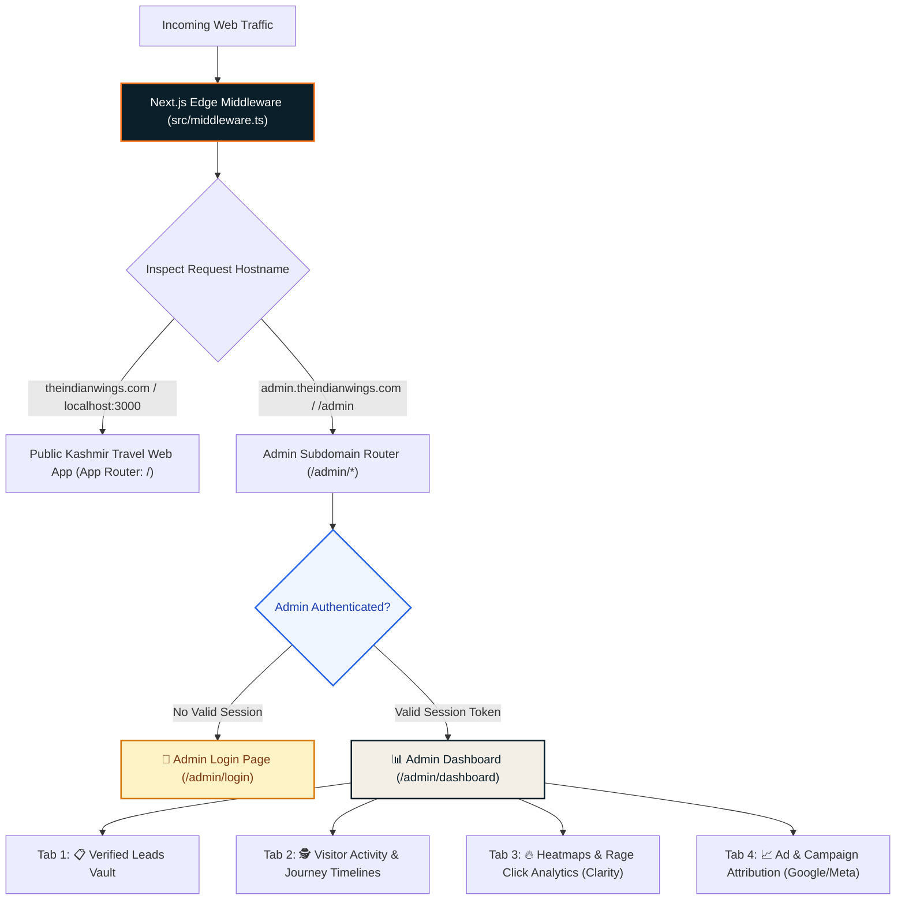
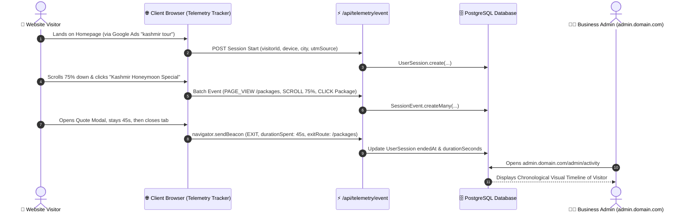

# Phase 11: Isolated Admin Portal (`admin.domain.com`) & Visitor Activity Telemetry Engine

## Phase Status: In Planning (Awaiting Approval) 📋

---

## 1. Executive Summary & Core Requirements

This document specifies the architecture, security perimeter, subdomain routing, and user interface for **The Indian Wings Company Admin Portal**.

### Primary Mandates:
1. **Subdomain Isolation**: The Admin Portal must be isolated from the consumer-facing website and accessible strictly via **`admin.theindianwings.com`** (with local dev fallback at `localhost:3000/admin` and subdomain simulation via Next.js Middleware).
2. **Dedicated Authentication Perimeter**: Separate, hardened admin authentication (Secure Session/JWT, HTTP-only cookies, brute-force rate-limiting) completely decoupled from public visitors.
3. **"User Activity, Heatmaps & Marketing Tracking" Hub**:
   - Complete visitor telemetry: entry time, route navigation, scroll depth milestones (25%, 50%, 75%, 100%), dwell times per section, package cards clicked, quote modals opened, and exit timestamps.
   - Every single tab must have a prominent **Human-Readable Description Banner** explaining what the tab does, what data it shows, and why it matters for business decisions.
4. **Lead Vault & Export**: Direct visibility into customer enquiries saved in PostgreSQL with 1-click WhatsApp specialist chat and Excel/CSV download. Zero unnecessary CRM bloat.

---

## 2. High-Level Subdomain & Traffic Routing Architecture



---

## 3. Subdomain Isolation Strategy (`admin.domain.com`)

### Why Subdomain Isolation?
- **Security Isolation**: Public visitors and search engine bots crawling `theindianwings.com` cannot discover or access admin routes.
- **Cookie Decoupling**: Admin session cookies are scoped strictly to `admin.theindianwings.com` with `HttpOnly`, `SameSite=Strict`, and `Secure` flags.
- **Brand Protection**: The public travel brand remains 100% focused on luxury tourism without exposing administrative URLs in public navigation or sitemaps.

### Implementation via Next.js Middleware:
```typescript
// Middleware routing logic overview
const hostname = request.headers.get('host') || '';
const isAdminSubdomain = hostname.startsWith('admin.') || request.nextUrl.pathname.startsWith('/admin');

if (isAdminSubdomain) {
  // 1. Verify admin auth token from HttpOnly cookie
  // 2. Redirect to /admin/login if unauthenticated
  // 3. Rewrite internal route to app/admin/*
}
```

---

## 4. First-Party Telemetry & Visitor Journey Engine

### Sequence: Real-Time Event Collection to Admin Timeline


---

## 5. Admin Panel Structure: Detailed Tab Layout with Human-Readable Descriptions

Every tab in the Admin Panel will feature a **Header Explanatory Banner** so anyone accessing the panel immediately understands what the data represents.

```
+-----------------------------------------------------------------------------------------+
|  THE INDIAN WINGS COMPANY — EXECUTIVE ADMIN PORTAL                   [Admin Logged In]  |
+-----------------------------------------------------------------------------------------+
|  [Tab 1: Verified Leads] | [Tab 2: User Journey Timelines] | [Tab 3: Heatmaps] | [Tab 4: Campaigns] |
+-----------------------------------------------------------------------------------------+
```

### 📋 Tab 1: Verified Customer Leads (`/admin/leads`)
- **Prominent Tab Description**:
  > *"This tab displays all customer inquiries that were actively submitted through the website's forms and modal popups. These records are stored permanently in your PostgreSQL database with contact information, travel preferences, and origin source."*
- **Contents**:
  - **Quick Stats Bar**: Total Leads Today, Leads This Month, Top Requested Trip Type.
  - **Interactive Leads Table**:
    - Customer Full Name & Phone Number (with formatted +91 / international country code).
    - **1-Click WhatsApp Button**: Directly opens WhatsApp with the customer's phone number pre-filled.
    - Tentative Travel Dates, Guest Count, Package Inquired.
    - Marketing Source (`utm_source` / Direct / Organic).
    - Lead Status Badge (`NEW`, `CONTACTED`, `QUOTED`, `WON`, `LOST`).
  - **Download CSV / Excel Button**: Exports all leads instantly for offline access.

---

### 🕵️ Tab 2: User Activity & Journey Timelines (`/admin/activity`)
- **Prominent Tab Description**:
  > *"This tab tracks real-time visitor journeys across your website. It shows how users navigated through your pages, where they scrolled, which packages they spent the most time looking at, and where they dropped off or abandoned without booking."*
- **Filter Bar**:
  - `All Visitors` | `Abandoned / Non-Bookers Only` | `Converted Customers Only` | `Filter by City/Source`.
- **Session List Card (Example Card)**:
  - **Visitor**: `#V-7401` *(Mobile Safari · iPhone 15 · Mumbai)*
  - **Source**: Google Search Ad — *Campaign: kashmir_honeymoon_luxury*
  - **Total Dwell Time**: `2 minutes 14 seconds`
  - **Status Badge**: `❌ Abandoned at Quote Modal (Step 4)`
- **Detailed Step-by-Step Journey View (Expands on Click)**:
  ```
  10:15:02 AM ── 🟢 Landed on Homepage (via Google Ads)
  10:15:18 AM ── 📜 Scrolled Homepage to 80% (Dwell Time: 16s)
  10:15:24 AM ── 🧭 Navigated to /packages
  10:15:35 AM ── 👁️ Focused on 'Kashmir Honeymoon Special' (Dwell Time: 42s)
  10:16:17 AM ── ⚡ Opened 'Get Quote' Modal
  10:16:45 AM ── 🚪 Closed Browser Tab (Exit Point: Quote Modal /packages)
  ```

---

### 🔥 Tab 3: Heatmaps, Rage Clicks & Session Replays (`/admin/heatmaps`)
- **Prominent Tab Description**:
  > *"This tab provides visual behavioral analytics powered by Microsoft Clarity. It enables you to watch actual screen recordings of real users navigating your site, see scroll heatmaps (where users lose interest), and identify 'Rage Clicks' (where users tapped repeatedly in frustration)."*
- **Embedded Metrics & Direct Deep-Links**:
  - **Scroll Depth Metrics**: Average percentage of page viewed across Desktop vs Mobile.
  - **Rage Click Hotspots**: Highlights buttons or cards where visitors experienced friction.
  - **Direct Clarity Launchpad**: Secure deep-link directly into your project's Microsoft Clarity session dashboard.
  - **Project ID Status Indicator**: Displays whether `NEXT_PUBLIC_CLARITY_ID` is active or pending configuration.

---

### 📈 Tab 4: Marketing & Ad Attribution Hub (`/admin/marketing`)
- **Prominent Tab Description**:
  > *"This tab breaks down your incoming traffic by marketing channels, paid ad campaigns, search keywords, and social platforms. Use this data to determine which ads are generating the highest volume of high-intent Kashmir inquiries."*
- **Breakdown Cards**:
  - **Top Traffic Channels**: Google Ads vs Instagram Reels vs Direct vs Organic.
  - **Campaign ROI Matrix**: Campaign Name, Total Clicks Recorded, Total Inquiries Generated, Conversion Rate %.
  - **Keyword Ingress**: Top Google search terms bringing high-dwell-time visitors to the site.

---

## 6. Database Schema Extensions (PostgreSQL)

To support first-party journey tracking without bogging down the database, two lightweight tables are added:

```prisma
// Visitor Session Metadata
model UserSession {
  id              String         @id @default(uuid())
  visitorId       String         @index
  name            String?        // Populated if visitor converts
  phone           String?        // Populated if visitor converts
  ipAddress       String?
  city            String?        
  device          String?        // "Mobile (iPhone)", "Desktop (Windows)"
  browser         String?        // "Safari", "Chrome"
  utmSource       String?        // "google_ads", "instagram"
  utmCampaign     String?        
  referrer        String?
  startedAt       DateTime       @default(now())
  endedAt         DateTime?      
  durationSeconds Int            @default(0)
  converted       Boolean        @default(false)
  enquiryId       String?        // Foreign key to Enquiry
  events          SessionEvent[]
  createdAt       DateTime       @default(now())

  @@index([visitorId])
  @@index([createdAt])
}

// Granular Journey Milestones
model SessionEvent {
  id              String       @id @default(uuid())
  sessionId       String
  session         UserSession  @relation(fields: [sessionId], references: [id], onDelete: Cascade)
  eventType       String       // PAGE_VIEW, SCROLL_DEPTH, CARD_CLICK, MODAL_OPEN, EXIT
  route           String       // "/", "/packages", "/transport"
  label           String?      // e.g. "Kashmir Honeymoon Special"
  durationSpent   Int?         // Seconds spent on this element/page
  metadata        Json?        // Flexible payload (e.g. { scrollPercent: 75 })
  timestamp       DateTime     @default(now())

  @@index([sessionId])
  @@index([timestamp])
}
```

---

## 7. 🛡️ Security & Privacy Defense (Priority 1)

| Defense Mechanism | Implementation | Threat Prevented |
| :--- | :--- | :--- |
| **Admin Route Brute-Force Shield** | Sliding-window limiter on `/api/admin/login` (Max 5 attempts / 15 mins). | Credential stuffing & dictionary password attacks. |
| **Tamper-Proof Session Cookie** | Signed HTTP-only, SameSite=Strict session cookie. | Session hijacking & client-side XSS cookie theft. |
| **Exit Telemetry Reliability** | `navigator.sendBeacon` + `visibilitychange` listener. | Lost exit data when visitor rapidly swipes away or closes mobile browser. |
| **Event Ingestion Throttling** | Client-side milestone debouncing (only emit at 25%, 50%, 75%, 100%). | Database CPU saturation from continuous scroll event floods. |
| **PII Data Redaction** | Session recordings never store or transmit sensitive form fields before submission. | Accidental privacy exposure under Indian DPDP Act. |

---

## 8. Verification & Acceptance Criteria

1. **Subdomain / Route Isolation**:
   - Direct access to `/admin` without authentication redirects immediately to `/admin/login`.
   - Logging in with valid credentials grants access to the dashboard.
2. **Visitor Journey Tracking**:
   - Visiting `/` and scrolling 50% logs a `PAGE_VIEW` and `SCROLL_DEPTH` event.
   - Navigating to `/packages` and opening the Quote modal logs `MODAL_OPEN`.
   - Closing the tab transmits an `EXIT` beacon with accurate `durationSeconds`.
   - Admin panel displays this sequence in an intuitive visual tree.
3. **Tab Explanatory Banners**:
   - Every tab displays its human-readable description at the top of the view.
4. **Lead Management**:
   - Leads from PostgreSQL display correctly with 1-click WhatsApp and CSV export working reliably.
