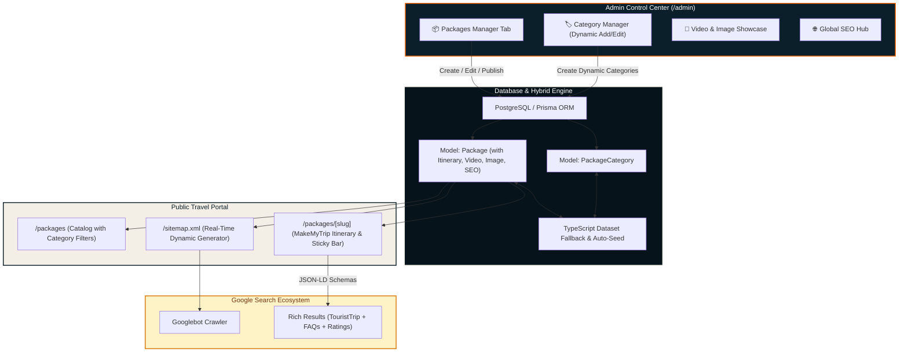

# Phase 12: Packages Architecture, Google SEO Compliance & Admin Control Hub

## Phase Status: Approved 🚀

---

## 1. Executive Summary & User Mandates

This document establishes the architecture, data layer, SEO infrastructure, and administrative interface for **The Indian Wings Company Packages Ecosystem**.

### Core Requirements (Approved by User):
1. **Google SEO Compliance**:
   - Every package has a dedicated crawlable canonical URL: `/packages/[slug]`.
   - Structured data (JSON-LD) implementing `TouristTrip` + `Product`, `BreadcrumbList`, and `FAQPage` schemas for rich search results.
   - **Dynamic Real-Time Sitemap (`/sitemap.xml`)**: Automatically updates at request-time whenever packages or categories are created or updated via API/admin.
2. **MakeMyTrip (MMT) Benchmark Layout**:
   - Hero header with photo/video gallery, ratings, duration, and transparent starting price.
   - Interactive day-by-day itinerary timeline (activities, meals, stays).
   - Visual Inclusions vs Exclusions grid (green checkmarks / red crossmarks).
   - Stays and transport fleet specifications.
   - High-converting MMT-style sticky bottom bar with pre-filled enquiry modal trigger.
3. **Admin Panel Control**:
   - **`Packages Manager` Tab**:
     - Create, view, edit, duplicate, and toggle publish status (`Active` / `Draft`).
     - **Dynamic Category Creation**: Admin can create and assign custom categories (not limited to 3 static types).
     - **Video & Image Support**: Ability to attach high-res images and video previews/embeds to package showcases.
     - **Embedded Package-Level SEO Controls**: Custom slug, meta title (50–60 chars), meta description (150–160 chars), focus keywords, canonical override, index/noindex toggle, and live Google SERP preview snippet.
   - **`SEO & Search Console` Tab**:
     - Global title template and default social share banners.
     - Live dynamic sitemap status and URL health inspector.
     - `robots.txt` rule manager and previewer.
     - Schema.org rich snippets auditor and social card preview simulator.

---

## 2. High-Level Architecture Diagram



---

## 3. Database Schema Specification

```prisma
model PackageCategory {
  id          String    @id @default(uuid())
  slug        String    @unique // e.g. "featured", "seasonal", "offbeat", "luxury-honeymoon"
  name        String    // e.g. "Featured & Classic", "Seasonal Specials"
  description String?
  sortOrder   Int       @default(0)
  isActive    Boolean   @default(true)
  packages    Package[]
  createdAt   DateTime  @default(now())
  updatedAt   DateTime  @updatedAt

  @@map("package_categories")
}

model Package {
  id            String          @id @default(uuid())
  slug          String          @unique // e.g. "kashmir-classic-odyssey-6d-5n"
  title         String
  categoryId    String
  category      PackageCategory @relation(fields: [categoryId], references: [id])
  duration      String          // e.g. "6 Days / 5 Nights"
  tag           String          @default("Best Seller")
  tagColor      String?
  imageUrl      String          // Primary display image
  videoUrl      String?         // Video preview / walkthrough URL (Cloudinary / YouTube / MP4)
  galleryUrls   String[]        // Additional photo gallery
  rating        Float           @default(4.9)
  reviewCount   Int             @default(120)
  destinations  String[]        // ["Srinagar", "Gulmarg", "Pahalgam"]
  inclusions    String[]
  exclusions    String[]
  highlights    String[]
  startingPrice Int
  originalPrice Int?
  isFeatured    Boolean         @default(false)
  isActive      Boolean         @default(true)
  sortOrder     Int             @default(0)

  // Itinerary JSON: [{ day: 1, title: "Arrival", description: "...", meals: "Dinner", stay: "Houseboat" }]
  itinerary     Json?

  // Package-Specific SEO Fields
  metaTitle       String?
  metaDescription String?
  keywords        String[]
  canonicalUrl    String?
  noIndex         Boolean       @default(false)

  createdAt     DateTime        @default(now())
  updatedAt     DateTime        @updatedAt

  @@index([categoryId])
  @@index([slug])
  @@index([isActive])
  @@map("packages")
}

model SiteSetting {
  id                     String   @id @default("global")
  siteTitle              String   @default("The Indian Wings Company | Premium Kashmir Travel")
  siteDesc               String   @default("Curated Kashmir holiday packages, luxury stays, and private transfers.")
  robotsTxtCustom        String?
  updatedAt              DateTime @updatedAt

  @@map("site_settings")
}
```

---

## 4. Google SEO Architecture & Structured Data

### 4.1 Schema.org JSON-LD Integration
Every package page at `/packages/[slug]` injects:
1. **`TouristTrip` & `Product`**:
   - `name`: Package title
   - `description`: Curated itinerary description
   - `offers`: Pricing in INR, `availability`: `"https://schema.org/InStock"`
   - `aggregateRating`: `ratingValue`, `reviewCount`, `bestRating`: 5
   - `itinerary`: Ordered array of tourist stops
2. **`BreadcrumbList`**:
   - Home ➔ Kashmir Tour Packages ➔ [Category Name] ➔ [Package Title]
3. **`FAQPage`**:
   - Common queries (e.g. Gondola cable car booking, heating in houseboats, best season) mapped to Google's FAQ rich snippets format.

### 4.2 Dynamic Real-Time Sitemap (`src/app/sitemap.ts`)
- Next.js dynamic metadata route pulling from database at request-time.
- Automatically generates entries for:
  - Static core routes (`/`, `/packages`, `/transport`, `/activities`, `/destinations`).
  - Every active package (`/packages/${pkg.slug}`) with dynamic `<lastmod>` set to `pkg.updatedAt`.
  - Revalidates dynamically on package publication.

---

## 5. MakeMyTrip Package Detail UX Component Breakdown

1. **`PackageHero`**:
   - Visual banner with high-resolution image or embedded video showcase.
   - Quick badges: Duration, rating, verified traveler count, destinations string.
   - Starting price per person with strike-through original price and savings badge.
2. **`PackageItineraryTimeline`**:
   - Interactive day-by-day accordion.
   - Morning, Afternoon, Evening activity highlights.
   - Icons for Meals (`☕ Breakfast`, `🍽️ Dinner`) and Stay (`🏨 4-Star Resort`).
3. **`PackageInclusionsExclusions`**:
   - Side-by-side 2-column or tabbed card:
     - ✅ **What's Included**: Private Cab, Boutique Stays, Shikara, Fuel & Tolls, 24/7 Ground Team.
     - ❌ **What's Excluded**: Airfare, Personal expenses, Gondola Phase 2, Monument entry fees.
4. **`PackageStayTransport`**:
   - Stays breakdown: Luxury Houseboat, Centrally Heated Riverside Resort.
   - Transport: Dedicated private sanitized vehicle (Innova Crysta / Sedan with snow chains).
5. **`PackageFaqSection`**:
   - Search-optimized expandable FAQs.
6. **`PackageStickyBar`**:
   - Fixed bottom bar on mobile / floating desktop widget with price and *"Customise / Enquire"* button that opens the enquiry modal with package title pre-filled.

---

## 6. Admin Panel Control Implementation

### 6.1 `TabPackages.tsx`
- **Category Filter Tabs**: Dynamic category pills + "Manage Categories" button.
- **Packages Data Grid**: Search by title or destination, filter by active/draft, sort by price or date.
- **Package Drawer / Form**:
  - Title, slug, duration, prices, tag, category dropdown (+ inline create category).
  - **Media**: Image URL input + Video URL input (Cloudinary/YouTube/MP4).
  - **Day-by-Day Itinerary Builder**: Add/remove days dynamically.
  - **Inclusions / Exclusions**: Tag list input.
  - **SEO Section**: Meta Title with character counter, Meta Description with counter, Keywords, and Live Google Search Snippet Simulator.
- **Category Modal**: Create new category with name, slug, and description.

### 6.2 `TabSeo.tsx`
- **Global Meta Settings**: Default title template, meta description.
- **Dynamic Sitemap Inspector**: Live status of `/sitemap.xml`, showing count of indexed package URLs and last generation timestamp.
- **Schema Health Auditor**: Displays status of `TouristTrip`, `BreadcrumbList`, and `FAQPage` schemas across all packages.
- **Social Card Simulator**: Visual simulator showing preview card on WhatsApp and social platforms.

---

## 7. Verification & Acceptance Criteria

1. **Database & API**:
   - `prisma db push` succeeds.
   - Seeding populates 3 categories and 18 packages with image/video and itinerary data.
   - Admin CRUD operations persist changes in real-time.
2. **Public Routing & MMT Experience**:
   - All package cards on `/packages` link to `/packages/[slug]`.
   - `/packages/[slug]` renders complete day-wise timeline, inclusions, exclusions, and sticky booking bar.
   - Tapping *"Enquire"* opens lead modal with pre-selected package details.
3. **SEO Validation**:
   - Source code of `/packages/[slug]` contains valid JSON-LD schemas.
   - Visiting `/sitemap.xml` dynamically outputs all package URLs with recent `<lastmod>` timestamps.
4. **Admin UI**:
   - Admin can add a new category.
   - Admin can add a video and image to a package.
   - Admin can edit SEO meta title/description with character counter and live Google preview.
