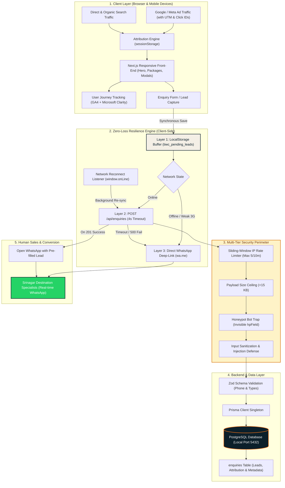
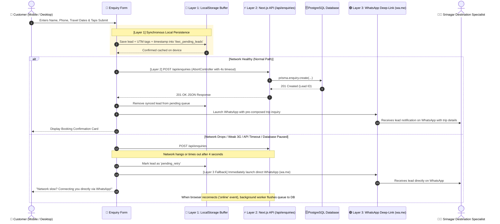
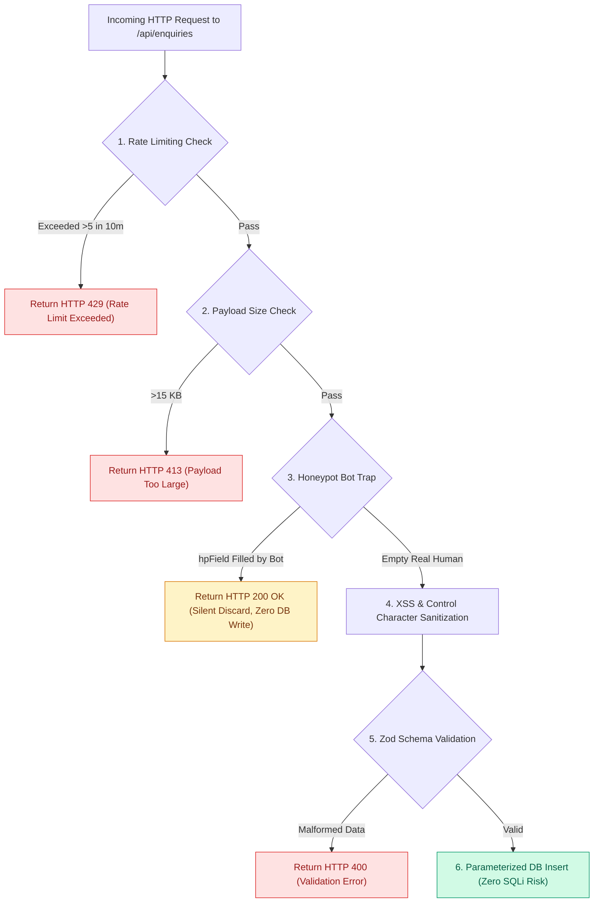
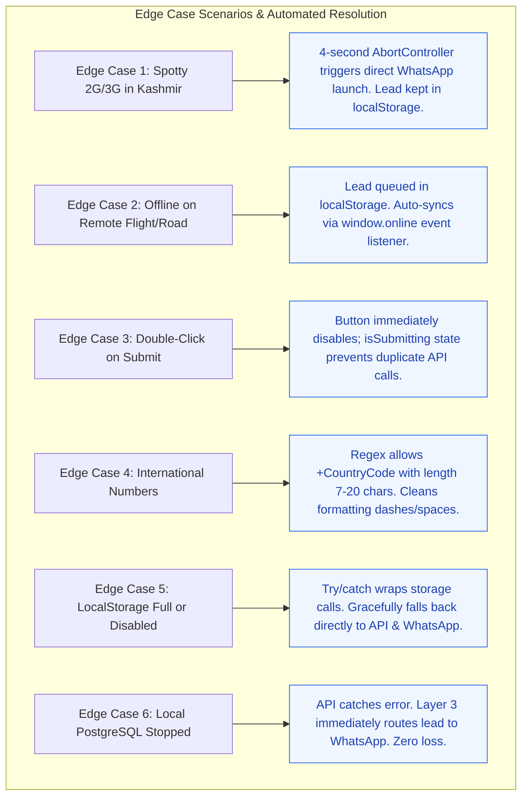
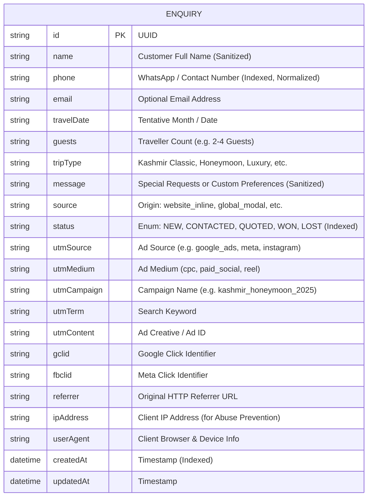
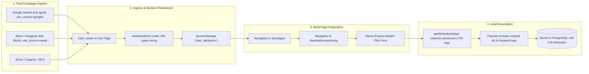
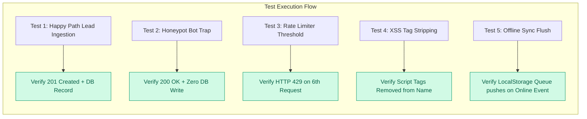

# Backend Architecture, Zero-Loss Lead Resilience & Security Engine
### The Indian Wings Company — Technical Architecture & Lead Pipeline Documentation

This document outlines the complete architectural design, database data models, zero-loss resilience engine, attribution tracking, multi-layer security defense, and edge-case handling for **The Indian Wings Company**.

---

## 1. System Architecture & High-Level Data Flow

---

## 2. The 3-Layer Zero-Loss Lead Resilience Sequence

---

## 3. 🛡️ Multi-Layer Security Architecture (Priority 1)

Security is the primary operational perimeter. Every request undergoes 5 defensive checks before touching PostgreSQL.

### Security Defenses Detailed

| Defense Mechanism | Implementation Detail | Attack Vector Prevented |
| :--- | :--- | :--- |
| **Sliding-Window Rate Limiter** | Max 5 requests per 10 minutes per client IP with automatic stale-memory garbage collection every 10m. | Spam bot form floods, Denial of Service (DoS), and fake lead bombing. |
| **Invisible Honeypot Bot Trap** | Invisible input `hpField` rendered off-screen with `aria-hidden="true" tabIndex={-1}`. Automated crawlers fill all fields; humans do not. | Automated spam bots & scraper tools. |
| **XSS & Injection Sanitization** | Regex-based HTML tag stripping (`/<[^>]*>?/gm`), javascript: protocol elimination, and non-printable control character removal (`[\x00-\x1F\x7F]`). | Cross-Site Scripting (XSS), script injection in CRM dashboards. |
| **Phone Number Normalization** | Strict digit extraction (`/[^\d+]/g`) ensuring clean international standard phone numbers. | Buffer overflow attempts, SQL injection payloads in phone fields. |
| **Payload Size Ceiling** | Request payload verified against 15 KB limit. | Memory exhaustion via oversized JSON blobs. |
| **Information Shielding** | Server-side stack traces logged internally; client receives sanitized error messages (`{ error: 'Database error' }`). | Infrastructure footprinting & information leakage. |

---

## 4. ⚡ Edge Cases & Failure Recovery Matrix

### Complete Edge Cases Matrix

| Edge Case Scenario | Trigger Condition | System Behavior & Mitigation | Result |
| :--- | :--- | :--- | :--- |
| **Slow 3G/2G Network** | Network latency > 4,000 ms | `AbortController` terminates hanging request at 4s. Lead remains in `tiwc_pending_leads`. WhatsApp deep link opens immediately. | **Zero Lead Loss.** Sales team contacted on WhatsApp; DB syncs later. |
| **Total Offline Mode** | `navigator.onLine === false` | Synchronously saves lead to `localStorage`. Bypasses failed fetch attempt. Opens WhatsApp. Registers background `online` event. | **Zero Lead Loss.** Lead flushes to PostgreSQL on reconnect. |
| **Rapid Double Click** | User taps submit button 2+ times in 1s | `isSubmitting` state locks submit button, displays spinner *"Securing Your Enquiry..."*, and rejects duplicate invocations. | **Zero Duplicate Records.** Clean database hygiene. |
| **LocalStorage Inaccessible** | Private browsing mode / quota reached | `try/catch` safety blocks ensure JavaScript execution never halts; form proceeds to API and WhatsApp without interruption. | **Unbreakable UI.** No client-side crashes. |
| **Bot Scraping Campaign** | Automated script posts to `/api/enquiries` | Rate limiter blocks after 5 requests (HTTP 429). Honeypot catches bot submissions and silently returns HTTP 200 without DB writes. | **Clean CRM.** Zero spam leads in database. |
| **Local Database Down** | PostgreSQL service stopped or restarted | API returns HTTP 500. Form error boundary catches response. WhatsApp opens directly with pre-composed inquiry. | **Human Fallback Active.** Lead received by specialist. |

---

## 5. Database Entity-Relationship Diagram (ERD)

---

## 6. Attribution & UTM Tracking Lifecycle

---

## 7. 🧪 Testing & Automated Verification Matrix

---

## 8. Technical File Mapping

| Component | File Path | Purpose & Security Responsibility |
| :--- | :--- | :--- |
| **Prisma Schema** | [`prisma/schema.prisma`](file:///c:/Users/hp/.gemini/antigravity-ide/scratch/the-indian-wings-company/prisma/schema.prisma) | PostgreSQL datasource, `Enquiry` model, and `EnquiryStatus` enum. |
| **Prisma Config** | [`prisma.config.ts`](file:///c:/Users/hp/.gemini/antigravity-ide/scratch/the-indian-wings-company/prisma.config.ts) | Prisma 7 configuration file mapping PostgreSQL datasource URL. |
| **DB Singleton** | [`src/lib/database/prisma.ts`](file:///c:/Users/hp/.gemini/antigravity-ide/scratch/the-indian-wings-company/src/lib/database/prisma.ts) | Next.js development-safe PrismaClient preventing pool exhaustion. |
| **Rate Limiter** | [`src/lib/security/rate-limit.ts`](file:///c:/Users/hp/.gemini/antigravity-ide/scratch/the-indian-wings-company/src/lib/security/rate-limit.ts) | In-memory sliding window rate limiter (5 req/10 min). |
| **Zod Sanitizer** | [`src/lib/validations/enquiry.ts`](file:///c:/Users/hp/.gemini/antigravity-ide/scratch/the-indian-wings-company/src/lib/validations/enquiry.ts) | XSS tag stripping, phone sanitization, and honeypot validation. |
| **Attribution Utility** | [`src/lib/utilities/attribution.ts`](file:///c:/Users/hp/.gemini/antigravity-ide/scratch/the-indian-wings-company/src/lib/utilities/attribution.ts) | Extracts UTM, GCLID, FBCLID from URL into `sessionStorage`. |
| **Offline Resilience** | [`src/lib/utilities/offline-queue.ts`](file:///c:/Users/hp/.gemini/antigravity-ide/scratch/the-indian-wings-company/src/lib/utilities/offline-queue.ts) | Layer 1 `localStorage` queue + background auto-sync on `window.online`. |
| **Analytics Engine** | [`src/lib/utilities/analytics.ts`](file:///c:/Users/hp/.gemini/antigravity-ide/scratch/the-indian-wings-company/src/lib/utilities/analytics.ts) | Custom event tracking for GA4 and Microsoft Clarity. |
| **Analytics Scripts** | [`src/components/analytics/AnalyticsScripts.tsx`](file:///c:/Users/hp/.gemini/antigravity-ide/scratch/the-indian-wings-company/src/components/analytics/AnalyticsScripts.tsx) | Script tags for GA4/Clarity + lifecycle event listeners in `layout.tsx`. |
| **API Route** | [`src/app/api/enquiries/route.ts`](file:///c:/Users/hp/.gemini/antigravity-ide/scratch/the-indian-wings-company/src/app/api/enquiries/route.ts) | `POST` endpoint with rate limiting, honeypot trap, and PostgreSQL write. |
| **Enquiry Form** | [`src/components/forms/EnquiryForm.tsx`](file:///c:/Users/hp/.gemini/antigravity-ide/scratch/the-indian-wings-company/src/components/forms/EnquiryForm.tsx) | 3-Layer resilience UI, double-click lock, and invisible honeypot field. |
