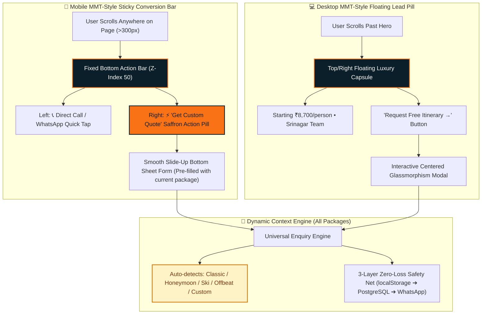
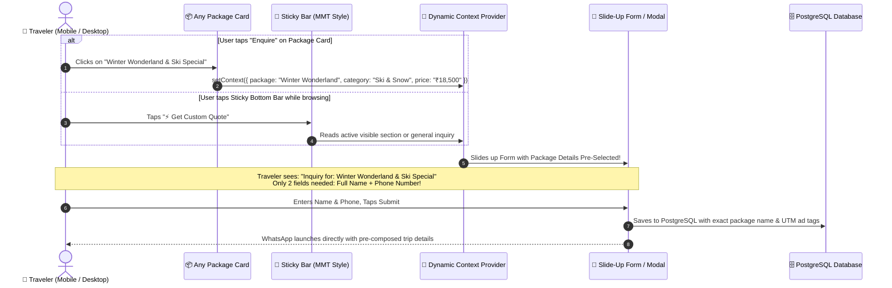

# MakeMyTrip-Style Sticky Lead Architecture & UI Placements
### The Indian Wings Company — High-Conversion UI Strategy & Architecture Documentation

This document outlines the MakeMyTrip (MMT) inspired sticky lead form placement architecture for **The Indian Wings Company**, designed for maximum mobile and desktop conversion across all current and future packages.

---

## 1. MakeMyTrip (MMT) UI Placement Anatomy



---

## 2. Dynamic Package Flow (Handles ALL Current & Future Packages)

This architecture is **not** hardcoded for any single package. It dynamically adapts to every package across the business:



---

## 3. Human-Readable Breakdown: Desktop vs Mobile

### A. Mobile Implementation (The MakeMyTrip Standard)
* **What the traveler sees**:
  - A clean, 60px fixed bottom bar that appears smoothly once the traveler scrolls past the hero section.
  - **Left Section (50%)**: Quick contact icons — a direct phone call button (`tel:`) and a WhatsApp icon.
  - **Right Section (50%)**: High-contrast, vibrant Saffron Orange button: **`⚡ Get Free Quote`**.
* **What happens when tapped**:
  - No page jump, no scrolling up or down.
  - An elegant **slide-up bottom sheet** opens from the bottom of their screen.
  - The form is already pre-filled with whatever package or destination they were looking at.
  - Input friction is minimal: **Full Name + Phone Number + Travel Month**.

---

### B. Desktop Implementation (Subtle Luxury Sticky Pill)
* **What the traveler sees**:
  - As the user scrolls through destinations, packages, or hotel partners, a floating luxury capsule appears in the top-right navigation area:
    > **Starting from ₹8,700 • Srinagar Team • `[ Plan Your Trip → ]`**
  - It stays accessible without obscuring any photos, itineraries, or text.
* **What happens when clicked**:
  - Opens the centered glassmorphism Enquiry Modal with the current package already selected in the dropdown.

---

### C. Package Card Contextual 1-Click Triggers
Every package card on the website (Featured, Seasonal, Off-Beat, Honeymoon, Winter Ski, Trekking) will have an **"Enquire Now"** action.
* When clicked on **Kashmir Classic Odyssey** ➔ Pre-fills *"Kashmir Classic Odyssey (5N/6D)"*.
* When clicked on **Winter Wonderland** ➔ Pre-fills *"Winter Wonderland & Ski Special (4N/5N)"*.
* When clicked on **Romantic Houseboat Retreat** ➔ Pre-fills *"Romantic Houseboat & Valley Retreat (Honeymoon)"*.
* When clicked on **Offbeat Gurez/Doodhpathri** ➔ Pre-fills *"Offbeat Kashmir Circuit"*.
* When client adds **New Packages in the Future** ➔ Automatically reads the new title and price without touching any code!

---

## 4. Comparison: The Indian Wings vs Competitors

| Feature | MakeMyTrip (MMT) | Flawed Competitors (`tourpackageskashmir.com`) | The Indian Wings Company (Our Plan) |
| :--- | :--- | :--- | :--- |
| **Mobile Sticky Bar** | Clean 2-button bar: Call + Get Quote | 4 overlapping, competing buttons | Clean, luxury bar: Quick WhatsApp/Call + Saffron `⚡ Get Quote` |
| **Form Interaction** | Slide-up bottom sheet (1-tap) | Harsh page jump to `#inquiry` 1,168px down | Instant slide-up sheet / modal (zero page jump) |
| **Package Pre-fill** | Dynamically pre-fills package | Requires typing free-form sentences | 100% pre-filled from package card |
| **Lead Resilience** | Saved to database | Zero database, direct WhatsApp redirect | **3-Layer Safety Net (LocalStorage ➔ PostgreSQL ➔ WhatsApp)** |
| **Security** | Enterprise rate limits & bot traps | None (vulnerable to spam) | Rate Limiting + Honeypot Trap + XSS Sanitization |

---

## 5. Implementation Roadmap (Following Strict Workflow)

```
[Phase 1: Planning]   ➔ DONE (Aligned on MakeMyTrip pattern)
[Phase 2: Document]   ➔ CURRENT (This document & diagrams prepared)
[Phase 3: Approval]   ➔ Awaiting your explicit review & approval (NO CODE YET)
[Phase 4: Code]       ➔ Implement Mobile Bottom Bar + Dynamic Package Context
[Phase 5: Security]   ➔ Verify honeypot, rate limits, and sanitization
[Phase 6: Test]       ➔ Mobile & desktop test on all package categories
```
